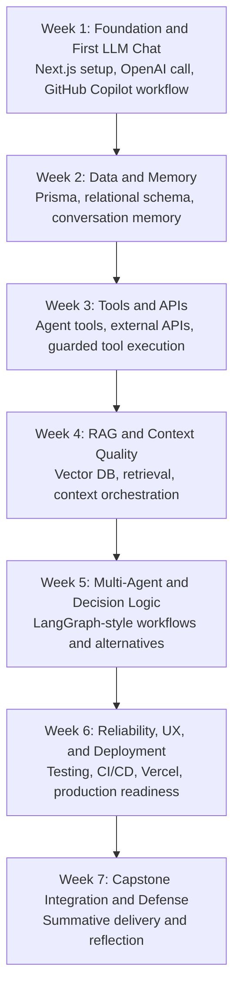

# CSAI 320 AI Full Stack Development - Overarching Design

## 1. Course Context

### Program
AI Full Stack Certificate at Ensign College

### Program Vision
This certificate prepares students to build AI-enabled software features for real products (web and mobile), including chatbots and agent-driven experiences for consumer and business use.

### Program-Specific Learning Outcomes (PLOs)
- PLO1: Proficiency in Python and Java for Software Development
- PLO2: Frontend Development Proficiency with React
- PLO3: Full-Stack Development and Cloud Deployment Expertise
- PLO4: Integration of AI and Large Language Models (LLMs)
- PLO5: Cloud Infrastructure and DevOps Implementation
- PLO6: Scalable and Event-Driven Application Development

### Career Pathways
Emerging roles include:
- AI Support Specialist
- AI Specialist
- AI Software Developer

## 2. Course Purpose (CSAI 320)
CSAI 320 gives students a hands-on pathway to design, build, and deploy cloud-based full-stack applications that integrate LLMs and AI agents.

Students complete a production-style project that includes frontend, backend, database, and AI capabilities, then deploy it publicly.

## 3. Course Learning Outcomes (CLOs)
1. Deploy an application onto AWS and confirm that it is publicly accessible via the internet.
2. Create a tiered full-stack application that includes a frontend, backend, database, and AI agents, and demonstrate end-to-end functionality.
3. Develop and assess a user interface that allows users to complete defined application tasks.
4. Use AI coding tools following effective context engineering and prompt engineering practices.
5. Apply and defend AI engineering best practices by documenting design decisions and ethical considerations within the project.
6. Design and implement AI-powered applications.

## 4. Competencies (CC) by CLO

### CLO 1: Deploy publicly
- CC1: Use Vercel to deploy the application.
- CC2: Set up a CI/CD pipeline between GitHub and Vercel.
- CC4: Store and use secrets/environment variables securely for production.

### CLO 2: Build tiered full-stack + AI agents
- CC3: Set up LangChain and obtain responses from a third-party model provider.
- CC6: Implement relational modeling (many-to-one, one-to-one, etc.).
- CC7: Retrieve information for frontend display and backend processing.
- CC10: Create a database using Vercel Storage.
- CC11: Store user information in the database.
- CC14: Connect TypeScript backend to database using Prisma Client.
- CC19: Implement chat UI for AI messaging (assistant-ui, Chatbot UI).

### CLO 3: Build a usable UI
- CC15: Use CSS to format components.
- CC16: Include a navigation bar.
- CC17: Include intuitive and well-labeled controls and visuals.
- CC18: Validate user input with graceful error handling.

### CLO 4 and CLO 5: Responsible AI pair-programming + engineering rigor
- CC8: Set up and query a vector database for RAG.
- CC21: Use LLMs to build dynamic components.
- CC__: Design agent rules and skills that satisfy architectural, security, and functional requirements.
- CC__: Engineer context, memory, and prompts to produce desired output.

### CLO 6: AI-powered implementation depth
- CC5: Follow an ERD to build Prisma schema.
- CC9: Plan and structure metadata.
- CC12: Use and understand FAISS and related options (Milvus, PGVector, Chroma).
- CC20: Integrate LLM usage into user-facing web features.
- CC22: Integrate intelligent automation and decision-making via LangChain.

## 5. Program-to-Course Alignment

| PLO | CSAI 320 Contribution |
|---|---|
| PLO1 | Reinforces prior backend foundations by applying software engineering patterns in TypeScript and API design. |
| PLO2 | Extends React capability through Next.js frontend architecture and UX implementation. |
| PLO3 | Strong direct alignment through complete full-stack architecture and cloud deployment. |
| PLO4 | Primary emphasis through LLM integration, agent behavior, RAG, and prompt/context engineering. |
| PLO5 | Direct support through CI/CD, environment management, secrets handling, and deployment operations. |
| PLO6 | Supported through modular architecture, asynchronous workflows, and agent/tool orchestration patterns. |

## 6. Instructional Architecture (7 Weeks)

## 7. Course Design Principles
- Build in public: every week advances the same capstone artifact.
- Learn by shipping: each module ends with a runnable feature.
- AI as partner, not autopilot: students must justify and document AI-assisted decisions.
- Progression model: use agents with GitHub Copilot first, then design and implement agents.
- Production mindset: from local prototype to cloud deployment with operational hygiene.

## 8. Technical Stack and Tooling
- Framework: Next.js 16 + TypeScript
- AI frameworks: LangGraph primary, with exposure to similar orchestration frameworks
- LLM provider: OpenAI (initial), then optional additional providers
- Data: Prisma + Vercel Storage
- Vector retrieval: FAISS and/or Milvus, PGVector, Chroma (comparative exposure)
- Deployment: Vercel with internet-accessible production URL
- Delivery operations: GitHub + GitHub Actions + CI checks
- Classroom workflow: GitHub Classroom templates

## 9. Starter-Code Strategy
Each major exercise uses a separate starter repository directory, each as a standalone Next.js 16 application.

Suggested directory pattern:
- starters/01-chat-basics-next16
- starters/02-memory-next16
- starters/03-tools-apis-next16
- starters/04-rag-next16
- starters/05-agent-workflows-next16
- starters/06-production-hardening-next16
- capstone/csai320-final

Each starter includes:
- baseline app scaffold
- TODO markers aligned to competencies
- integration tests pre-defined
- GitHub Actions workflow for validation on push
- local test instructions using .env configuration

## 10. Assessment and Evidence Model

### Formative (Weekly)
- Feature checkpoints aligned to weekly theme
- Reflection notes on AI usage, prompt/context changes, and tradeoffs
- Instructor and peer feedback cycles

### Summative (Week 7)
- Publicly accessible deployed application
- End-to-end demonstration (frontend-backend-database-agent)
- Technical defense of architecture and ethics decisions
- Repository evidence: commits, tests, pipeline, and documentation

## 11. Testing and Delivery Workflow
- Students clone assignments from GitHub Classroom template repos.
- Students implement features locally and run integration tests.
- Students store API keys/secrets in environment variables and Vercel project settings.
- On push, GitHub Actions runs integration tests.
- Passing checks gate deployment quality and readiness.

## 12. Faith-Informed Integration (Subtle, Intentional)
The course can integrate discipleship values naturally through engineering behaviors:
- Service: design features that reduce user friction and increase accessibility.
- Integrity: cite AI assistance honestly and avoid fabricated outputs.
- Stewardship: build maintainable solutions and protect user data.
- Peacemaking in teams: practice respectful collaboration, review feedback charitably, and communicate clearly.

These values are embedded in rubrics and reflection prompts rather than treated as separate heavy content.

## 13. Week-by-Week Scope (Summary)
- Week 1: First chat app and GitHub Copilot workflow foundations.
- Week 2: Data models and memory-enabled interactions.
- Week 3: Tool calling and external API integration.
- Week 4: RAG architecture and retrieval quality.
- Week 5: Agent rules, skills, and multi-step orchestration.
- Week 6: Reliability, security, CI/CD, deployment hardening.
- Week 7: Capstone completion, presentation, and defense.

## 14. Risks and Mitigations
- Risk: Overreliance on AI-generated code.
  - Mitigation: Require rationale logs and code walkthrough checkpoints.
- Risk: API cost or key management issues.
  - Mitigation: low-cost providers, usage limits, and secret-handling policy.
- Risk: Uneven prior student skill.
  - Mitigation: scaffolded starters and incremental competency gates.

## 15. Deliverables Produced by This Design
- One evolving capstone application across 7 weeks
- Weekly artifacts mapped to competencies
- Final deployed product + technical and ethical defense documentation
